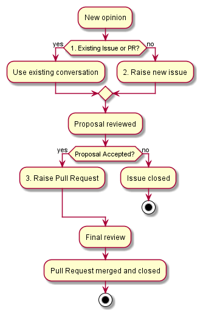

# Contributing to the CSP Department Technology Radar
We greatly appreciate and encourage members of the department to contribute towards keeping the technology radar relevant and up to date.

## Contributing Guidelines
Do you have an opinion on some software engineering technology or technique for the department?
If so, you can easily propose a new idea using the following steps:
1. First search for any relevant issues and pull requests already on this repository. There might already be an ongoing conversation or a previous reason why the idea hasn’t been accepted. This will help prevent duplicating conversations.
2. If an issue doesn't already exist, please start off by creating one. This creates a place for a conversation to be started before going through the effort of creating a new entry on the radar. 
3. Once your proposal is discussed and accepted, the new entry can be submitted by creating a Pull Requests following the guidelines below.

### Creating an Issue
Please use the issue template provided to ensure you capture the right information needed to discuss your proposal.

### Creating a Pull Request
* Clone the csp-tech-radar repository to your computer.
* Create a new branch for your work and make your desired changes to the [csp-tech-radar.csv](csp-tech-radar.csv).
* Push your branch with your changes and test the changes render correctly in the [Thoughtworks Radar Tool](https://radar.thoughtworks.com/) as per the [README](README.md) testing guidelines.
* When you are happy, raise a Pull Request from your branch to master. Make sure you give enough information in the pull request description to describe the new or changed opinion.
* Link your Pull Request to the relevant Issue.
* Your Pull Request must be reviewed by at least two core maintainers.
* One of the core maintainers will merge the change.

## Core Maintainers
[@csp-tech-leads team](https://github.com/orgs/sky-uk/teams/csp-tech-leads)
